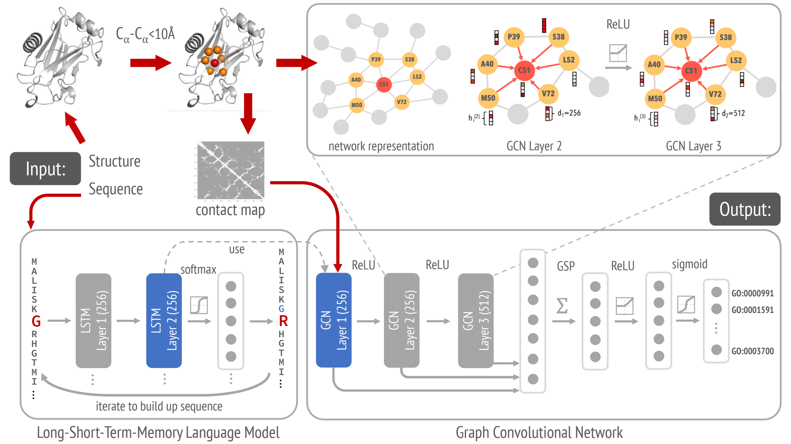

# DeepFRIer
Deep functional residue identification


# Citing
```
@article {Gligorijevic2019,
	author = {Gligorijevic, Vladimir and Renfrew, P. Douglas and Kosciolek, Tomasz and Leman,
	Julia Koehler and Cho, Kyunghyun and Vatanen, Tommi and Berenberg, Daniel
	and Taylor, Bryn and Fisk, Ian M. and Xavier, Ramnik J. and Knight, Rob and Bonneau, Richard},
	title = {Structure-Based Function Prediction using Graph Convolutional Networks},
	year = {2019},
	doi = {10.1101/786236},
	publisher = {Cold Spring Harbor Laboratory},
	URL = {https://www.biorxiv.org/content/early/2019/10/04/786236},
	journal = {bioRxiv}
}

```
## Dependencies

*DeepFRIer* is tested to work under Python 3.6.

The required dependencies for *deepFRIer* are [Keras](https://keras.io/), [TensorFlow](https://www.tensorflow.org/), [Numpy](http://www.numpy.org/) and [scikit-learn](http://scikit-learn.org/).

## Data

Data (*tfrecord* train/validation files) used for producing figures in the paper can be downloaded from:

https://users.flatironinstitute.org/vgligorijevic/public_www/deepFRIer

## Training DeepFRI
To train *deepFRI* run the following command from the project directory:
```
python train_DeepFRI.py --model_name model_name
```

# FLAGS

A number of FLAGS is available to specify the behavior of *deepFRI*, both for prediction and training:

* `model_name`      str, name of the model. Default: `GCN-LM_model`
* `gcn_dims`        list (int), dimensions of GCN layers. Default: `[128, 256, 512]`
* `hidden_dims`	    list (int), dimensions of Dense layers. Default: `[512]`
* `dropout`	    float, dropout rate for Dense layer. Default: `0.30`
* `l2_reg` 	    float, l2 regularization coefficient for GCN layers. Default: `1e-4`
* `epochs`          int, number of epochs to train the model. Default: `100`
* `batch_size`	    int, Batch size. Default: `64`
* `pad_len`         int, maximum padding length for sequences and contact maps. Default: `1000`
* `results_dir`     str, directory with exported models and results. Default: `./results/`
* `ont`             str, GO or EC ontology. Default: `molecular function`
* `cmap_type`       str, yype of contact maps (A_nbr, A_ca or A_all). Default: `A_ca`
* `lm_model_name`   str, keras pre-trained LSTM Language Model name. Default: `lstm_lm.h5`
* `split_fn`        str, pickle file with train/test/valid PDB IDs. Default: `pdb_GO_train_test_split_bc_30.pckl`
* `catalogue`       str, csv file mapping PDB IDs to numpy files storing individual contact maps. Default: `catalogue.csv`
* `train_tfrecord_fn`	str, train tfrecords file name. Default: `train.tfrecords`
* `valid_tfrecord_fn`	str, validaiton tfrecords file name. Default: `valid.tfrecords`
