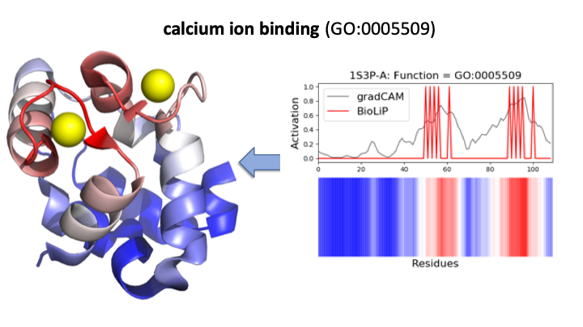

# DeepFRI
Deep functional residue identification


## Citing
```
@article {Gligorijevic2019,
	author = {Gligorijevic, Vladimir and Renfrew, P. Douglas and Kosciolek, Tomasz and Leman,
	Julia Koehler and Cho, Kyunghyun and Vatanen, Tommi and Berenberg, Daniel
	and Taylor, Bryn and Fisk, Ian M. and Xavier, Ramnik J. and Knight, Rob and Bonneau, Richard},
	title = {Structure-Based Function Prediction using Graph Convolutional Networks},
	year = {2019},
	doi = {10.1101/786236},
	publisher = {Cold Spring Harbor Laboratory},
	URL = {https://www.biorxiv.org/content/early/2019/10/04/786236},
	journal = {bioRxiv}
}

```
## Dependencies

*DeepFRI* is tested to work under Python 3.6.

The required dependencies for *deepFRI* are [Keras](https://keras.io/), [TensorFlow](https://www.tensorflow.org/), [Numpy](http://www.numpy.org/) and [scikit-learn](http://scikit-learn.org/).
To install all dependencies run:

```
pip install -r dependencies.txt
```


# Protein function prediction
To predict protein functions use `predict.py` script with the following options:

* `seq`             str, Protein sequence as a string
* `cmap`            str, Name of a file storing a protein contact map and sequence in `*.npz` file format (with the following numpy array variables: `A_ca_10A`, `sequence`, `L`)
* `cmap_csv`        str, Filename of the catalogue (in `*.csv` file format) containg mapping between protein names and directory with `*.npz` files (see `examples/catalogue_pdb_chains.csv`)
* `fasta_fn`        str, Fasta filename
* `output_fn_prefix`str, Output filename for saving predictions and class activation maps.
* `verbose`         bool, Whether or not to print function prediction results.
* `saliency`        bool, Whether or not to compute class activaton maps.

Generated files:
* `output_fn_prefix_MF_predictions.csv`   Predictions in the `*.csv` file format with columns: Protein, GO-term/EC-number, Score, GO-term/EC-number name.
* `output_fn_prefix_MF_saliency_maps.pckl` pickle file storing a dictionary of saliency maps for each predicted function of every protein.

*DeepFRI* offers 4 possible options for predicting functions. See examples below.

## Option 1: predicting functions of a protein from its contact map

Example: predicting MF-GO terms for Parvalbumin alpha protein using its sequence and contact map (PDB: [1S3P](https://www.rcsb.org/structure/1S3P)):

```
>> python predict.py --cmap examples/1S3P-A.npz --verbose

```

### Output:


```txt
Protein GO-term/EC-number Score GO-term/EC-number name
1S3P-A GO:0043167 0.95134 ion binding
1S3P-A GO:0046872 0.90832 metal ion binding
1S3P-A GO:0043169 0.90517 cation binding
1S3P-A GO:0005509 0.87179 calcium ion binding
1S3P-A GO:0043168 0.06332 anion binding
1S3P-A GO:0031072 0.00247 heat shock protein binding
1S3P-A GO:1901567 0.00099 fatty acid derivative binding
1S3P-A GO:0045159 0.00009 myosin II binding
1S3P-A GO:0032027 0.00001 myosin light chain binding

```

## Option 2: predicting functions of a protein from its sequence

Example: predicting MF-GO terms for Parvalbumin alpha protein using its sequence (PDB: [1S3P](https://www.rcsb.org/structure/1S3P)):

```
>> python predict.py --seq 'SMTDLLSAEDIKKAIGAFTAADSFDHKKFFQMVGLKKKSADDVKKVFHILDKDKDGFIDEDELGSILKGFSSDARDLSAKETKTLMAAGDKDGDGKIGVEEFSTLVAES' --verbose

```

### Output:


```txt
Protein GO-term/EC-number Score GO-term/EC-number name
query_prot GO:0005509 0.99434 calcium ion binding
query_prot GO:0046872 0.98379 metal ion binding
query_prot GO:0043169 0.98373 cation binding
query_prot GO:0043167 0.97652 ion binding
query_prot GO:0017022 0.00591 myosin binding
query_prot GO:0043236 0.00045 laminin binding
query_prot GO:0045159 0.00015 myosin II binding
query_prot GO:0019237 0.00003 centromeric DNA binding
query_prot GO:0017151 0.00002 DEAD/H-box RNA helicase binding
query_prot GO:0032027 0.00001 myosin light chain binding
query_prot GO:0000171 0.00001 ribonuclease MRP activity
```

## Option 3: predicting functions of proteins from a fasta file

```
>> python predict.py --fast_fn examples/pdb_chains.fasta

```

## Option 4: predicting functions of proteins from contact map catalogue

```
>> python predict.py --cmap_csv examples/catalogue_pdb_chains.csv -o DeeFRI_pdb_chain --saliency

```

### Output:
see files:
```
examples/outputs/DeepFRI_pdb_chains_MF_saliency_maps.pckl`, `examples/outputs/DeepFRI_pdb_chains_MF_predictions.csv`
```


# Training DeepFRI
To train *deepFRI* run the following command from the project directory:
```
>> python train_DeepFRI.py --model_name model_name_prefix
```

## Output
Generated files:
* `model_name_prefix_model.hdf5`   trained model with architecture and weights saved in HDF5 format
* `model_name_prefix_pred_scores.pckl` pickle file with predicted GO term/EC number scores for test proteins
* `model_name_prefix_metadata.pckl` pickle file with metadata (GO terms/names, EC numbers/names, optimal thresholds for each GO term/EC number)

See examples of pre-trained models in: `trained_models/`.

# Flags

A number of FLAGS is available to specify the behavior of *deepFRI*, both for prediction and training:

* `model_name`      str, name of the model. Default: `GCN-LM_model`
* `gcn_dims`        list (int), dimensions of GCN layers. Default: `[128, 256, 512]`
* `hidden_dims`	    list (int), dimensions of Dense layers. Default: `[512]`
* `dropout`	    float, dropout rate for Dense layer. Default: `0.30`
* `l2_reg` 	    float, l2 regularization coefficient for GCN layers. Default: `1e-4`
* `epochs`          int, number of epochs to train the model. Default: `100`
* `batch_size`	    int, Batch size. Default: `64`
* `pad_len`         int, maximum padding length for sequences and contact maps. Default: `1000`
* `results_dir`     str, directory with exported models and results. Default: `./results/`
* `ont`             str, GO or EC ontology. Default: `molecular function`
* `cmap_type`       str, type of contact maps (A_nbr, A_ca or A_all). Default: `A_ca`
* `lm_model_name`   str, keras pre-trained LSTM Language Model name. Default: `./trained_models/lstm_lm.h5`
* `split_fn`        str, pickle file with train/test/valid PDB IDs and their annotatin matrix. Default: `train_test_split_seqsim_30.pckl` (see Data section below)
* `catalogue`       str, csv file mapping PDB IDs to numpy files storing individual contact maps. Default: `catalogue.csv`
* `train_tfrecord_fn`	str, train tfrecords file name. Default: `train.tfrecords` (see Data section below)
* `valid_tfrecord_fn`	str, validaiton tfrecords file name. Default: `valid.tfrecords` (see Data section below)


# Functional residue identification
To visualize class activation (saliency) maps use `viz_saliency.py` script with the following options:

* `saliency_fn` str, pickle filename with saliency maps generated by `predict.py` script (see Option 4 above)
* `list_all`    bool, list all proteins and their predicted GO terms with corresponding class activation (saliency) maps
* `protein_id`  str, protein (PDB chain), saliency maps of which are to be visualized for each predicted function
* `go_id`       str, GO term, saliency maps of which are to be visualized
* `go_name`     str, GO name, saliency maps of which are to be visualized

Generated files:
* `saliency_fig_PDB-chain_GOname.png`  class activation (saliency) map profile over sequence (see fig below, right)
* `pymol_viz.py` pymol script for mapping salient residues onto 3D structure (pymol output is shown in fig below, left)

## Example:

```
>>> python viz_saliency.py --saliency_fn examples/outputs/DeepFRI_pdb_chains_MF_saliency_maps.pckl --protein_id 1S3P-A --go_id GO:0005509
```

### Output:



# Data

Data (*train.tfrecord*, *valid.tfrecord* files) used for re-training the model can be downloaded from:

https://users.flatironinstitute.org/vgligorijevic/public_www/DeepFRI
